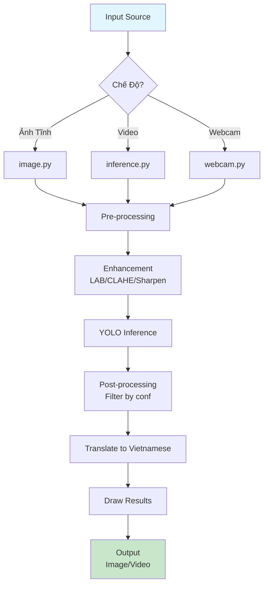

# 📋 BÁO CÁO PHÂN TÍCH SOURCE CODE
## Đề tài: Nhận Diện Biển Báo Giao Thông Việt Nam (YOLOv8)

---

## 🎯 Tổng Quan

**Mục Đích:** Nhận diện tự động **29 nhóm biển báo giao thông Việt Nam** sử dụng YOLOv8

**Ba Chế Độ Xử Lý:**
- 🖼️ Ảnh tĩnh
- 🎬 Video
- 📹 Webcam (real-time)

**Yêu Cầu:**
- Python 3.8-3.11
- RAM: 8GB (16GB + GPU để hiệu năng tốt)
- GPU: NVIDIA (tùy chọn, tăng tốc độ 8-10x)

---

## 📁 Cấu Trúc Dự Án

```
CuoiKyThaySau/
├── main.py                      # GUI chính (tkinter)
├── requirements.txt             # Thư viện cần cài
│
├── Detection/                   # Module xử lý
│   ├── image.py                # Nhận diện ảnh tĩnh
│   ├── inference.py            # Xử lý video
│   └── webcam.py               # Webcam real-time
│
├── model/                     # Mô hình đã huấn luyện
│   ├── best.pt           # Trọng số YOLOv8 (200MB)
│   ├── classes.txt            # 29 lớp biển báo
│   ├── custom_data.yaml       # Config huấn luyện
│   └── data.yaml              # Config dữ liệu
│
└── output/                      # Kết quả xử lý
    └── bienbao/
```

---

## 🔧 Các Module Chính

### 1. **main.py** - Giao Diện GUI
- Cung cấp giao diện tkinter thân thiện
- 3 nút chọn: Ảnh, Video, Webcam
- Gọi các module Detection tương ứng
```bash
python main.py
```

### 2. **Detection/image.py** - Xử Lý Ảnh Tĩnh
- Nhận diện ảnh đơn hoặc batch thư mục
- Vẽ bbox với màu theo nhóm biển báo
- Lưu kết quả với nhãn tiếng Việt
```bash
python Detection/image.py --image_path test.jpg --conf 0.25 --imgsz 640
```

**Lớp chính:** `TrafficSignDetector`
- `detect(image_path)` → Phát hiện biển báo
- `draw_results(image_path, output_path)` → Vẽ kết quả

### 3. **Detection/inference.py** - Xử Lý Video
- Tối ưu imgsz dựa trên độ phân giải video
- Hỗ trợ frame skipping (tăng tốc độ)
- Caching font & model
- Lưu video output MP4
```bash
python Detection/inference.py --source video.mp4 --imgsz 832 --skip 1
```

### 4. **Detection/webcam.py** - Webcam Real-time
- Nhận diện từ webcam trực tiếp
- Hiển thị FPS, frame counter
- Lưu video kết quả (option)
- Chụp screenshot (phím 's')
```bash
python Detection/webcam.py --enhance --clahe --save
```

**Key Bindings:**
- `q` = Thoát
- `s` = Chụp ảnh

---

## 🔄 Workflow Xử Lý

### Sơ Đồ Tổng Quát



### Chi Tiết Các Bước

#### **1. Input**
- Ảnh: `cv2.imread(image_path)`
- Video: `cv2.VideoCapture(video_path)`
- Webcam: `cv2.VideoCapture(camera_index)`

#### **2. Tiền Xử Lý (Enhancement)**

| Kỹ Thuật | Công Dụng | Khi Nào Dùng |
|---------|----------|------------|
| **LAB Enhancement** | Tăng brightness/contrast | Ảnh quá tối/sáng |
| **CLAHE** | Histogram cân bằng địa phương | Vùng sáng/tối không đều |
| **Sharpening** | Làm sắc nét chi tiết | Ảnh mờ |

```python
# Ví dụ kết hợp
if args.enhance:
    frame = enhance_image(frame, brightness=1.0, contrast=1.2)
if args.clahe:
    frame = apply_clahe(frame)
if args.sharpen:
    frame = sharpen_image(frame)
```

#### **3. Inference (YOLO Dự Đoán)**

```
Original Image (H×W)
    ↓
Resize → imgsz×imgsz (640/832/1024/1280)
    ↓
Pass through YOLOv8 model
    ↓
Output: 
  - Bounding boxes (x1,y1,x2,y2)
  - Class IDs (0-28)
  - Confidence scores
    ↓
Scale back to original size
```

**imgsz Impact:**
- `640` = Nhanh, chính xác trung bình
- `832` = Cân bằng
- `1024` = Chính xác cao
- `1280` = Chính xác cực cao, chậm nhất

#### **4. Post-processing**
- Lọc theo `--conf` threshold
- Scale tọa độ về ảnh gốc
- Dịch tên class sang tiếng Việt (từ `VIE_NAMES` dict)

#### **5. Hiển Thị & Lưu Trữ**

```
For each detection:
    ├─ Get bbox color (dựa theo nhóm)
    ├─ Draw rectangle
    ├─ Draw text (tiếng Việt, dùng PIL)
    └─ Save output
```

**Quy Tắc Màu:**
- 🔴 Cấm (RED): `(0,0,220)`
- 🟠 Cảnh báo (ORANGE): `(0,165,255)`
- 🔵 Chỉ dẫn (BLUE): `(200,100,0)`
- 🟢 Hết cấm (GREEN): `(0,180,0)`

---

## 💻 Công Nghệ Sử Dụng

| Thư Viện | Tác Dụng |
|----------|---------|
| **ultralytics** | YOLOv8 model & inference |
| **PyTorch** | Deep learning backend |
| **OpenCV** | Image/video I/O & processing |
| **NumPy** | Numerical computing |
| **Pillow** | Image + Unicode text rendering |
| **PyYAML** | Config file parsing |

### Cài Đặt

```bash
# 1. Tạo virtual environment
python -m venv venv
venv\Scripts\activate          # Windows
source venv/bin/activate       # Linux/Mac

# 2. Cài dependencies
pip install -r requirements.txt

# 3. Nếu không có GPU (CPU only)
pip install torch==2.2.2 torchvision==0.17.2 \
  --index-url https://download.pytorch.org/whl/cpu
```

---

## 💾 Mã Nguồn Triển Khai Tiêu Biểu

### **1. Khởi Tạo & Load Mô Hình**

```python
# Trích xuất từ Detection/image.py & webcam.py
import cv2
from ultralytics import YOLO
import numpy as np
from PIL import Image, ImageDraw, ImageFont

# 1️⃣ Khởi tạo mô hình YOLO
class TrafficSignDetector:
    def __init__(self, model_path="model02/best28121.pt", conf=0.25, imgsz=640):
        """Khởi tạo detector"""
        if not os.path.exists(model_path):
            raise FileNotFoundError(f"Không tìm thấy mô hình: {model_path}")
        
        self.model = YOLO(model_path)
        self.conf = conf
        self.imgsz = imgsz
        print(f"✓ Tải mô hình: {model_path}")
        print(f"✓ Ngưỡng tự tin (conf): {conf}")
        print(f"✓ Kích thước xử lý (imgsz): {imgsz}px")
```

### **2. Tiền Xử Lý & Enhancement**

```python
# Trích xuất từ Detection/inference.py

# 2️⃣ Hàm LAB Enhancement
def enhance_image(frame, brightness=1.0, contrast=1.2):
    """Tăng cường ảnh bằng LAB Color Space"""
    # Chuyển sang LAB color space
    lab = cv2.cvtColor(frame, cv2.COLOR_BGR2LAB)
    l, a, b = cv2.split(lab)
    
    # Tăng contrast cho kênh L (Luminance)
    l = cv2.convertScaleAbs(l, alpha=contrast, beta=brightness * 10)
    l = np.clip(l, 0, 255).astype(np.uint8)
    
    # Gộp lại & convert về BGR
    enhanced_lab = cv2.merge([l, a, b])
    enhanced = cv2.cvtColor(enhanced_lab, cv2.COLOR_LAB2BGR)
    
    return enhanced

# 3️⃣ Hàm CLAHE (Adaptive Histogram Equalization)
def apply_clahe(frame, clip_limit=2.0, tile_size=(8, 8)):
    """Cân bằng histogram adaption - tăng chi tiết địa phương"""
    gray = cv2.cvtColor(frame, cv2.COLOR_BGR2GRAY)
    clahe = cv2.createCLAHE(clipLimit=clip_limit, tileGridSize=tile_size)
    enhanced = clahe.apply(gray)
    
    # Chuyển lại sang BGR
    enhanced_bgr = cv2.cvtColor(enhanced, cv2.COLOR_GRAY2BGR)
    return enhanced_bgr

# 4️⃣ Hàm Sharpening
def sharpen_image(frame, kernel_strength=1.5):
    """Làm sắc nét ảnh"""
    kernel = np.array([[-1, -1, -1],
                       [-1,  9, -1],
                       [-1, -1, -1]]) / kernel_strength
    sharpened = cv2.filter2D(frame, -1, kernel)
    return np.uint8(np.clip(sharpened, 0, 255))
```

### **3. Xử Lý Frame & Inference**

```python
# Trích xuất từ Detection/webcam.py & inference.py

# 5️⃣ Hàm xử lý frame (main processing)
def process_frame(frame, model, args):
    """Xử lý 1 frame với tất cả enhancement"""
    
    # Tiền xử lý
    frame_processed = frame.copy()
    
    if args.enhance:
        frame_processed = enhance_image(
            frame_processed, 
            brightness=args.brightness, 
            contrast=args.contrast
        )
    
    if args.clahe:
        frame_processed = apply_clahe(frame_processed)
    
    if args.sharpen:
        frame_processed = sharpen_image(frame_processed)
    
    # Inference
    results = model.predict(
        source=frame_processed, 
        conf=args.conf, 
        imgsz=args.imgsz,
        verbose=False
    )
    
    return results, frame_processed

# 6️⃣ Vòng lặp chính (Main Loop)
def main_detection_loop():
    """Vòng lặp chính cho webcam real-time"""
    
    # Tải model
    model = YOLO("model02/best28121.pt")
    
    # Mở webcam
    cap = cv2.VideoCapture(0)
    cap.set(cv2.CAP_PROP_FRAME_WIDTH, 1280)
    cap.set(cv2.CAP_PROP_FRAME_HEIGHT, 720)
    
    frame_count = 0
    fps_list = []
    
    while True:
        ret, frame = cap.read()
        if not ret:
            break
        
        frame_count += 1
        start_time = time.time()
        
        # Xử lý
        results, processed = process_frame(frame, model, args=args)
        
        # Vẽ kết quả
        annotated = draw_detections(processed, results)
        
        # Tính FPS
        fps = 1 / (time.time() - start_time)
        fps_list.append(fps)
        avg_fps = np.mean(fps_list[-30:])
        
        # Hiển thị
        cv2.putText(annotated, f"FPS: {avg_fps:.1f}", (10, 30),
                    cv2.FONT_HERSHEY_SIMPLEX, 0.7, (0, 255, 0), 2)
        cv2.imshow("Detection", annotated)
        
        # Thoát nếu nhấn 'q'
        if cv2.waitKey(1) & 0xFF == ord('q'):
            break
    
    cap.release()
    cv2.destroyAllWindows()
```

### **4. Hậu Xử Lý & Hiển Thị**

```python
# Trích xuất từ Detection/image.py & inference.py

# 7️⃣ Danh sách tên biển báo (VIE_NAMES Dictionary)
VIE_NAMES = {
    "one way prohibition": "Cấm đi ngược chiều",
    "no parking": "Cấm đỗ xe",
    "no stopping and parking": "Cấm dừng và đỗ xe",
    "no turn left": "Cấm rẽ trái",
    "no turn right": "Cấm rẽ phải",
    "speed limit": "Giới hạn tốc độ",
    "pedestrian crossing": "Đường người đi bộ cắt ngang",
    "indication": "Biển chỉ dẫn",
    # ... (26 loại khác)
}

# 8️⃣ Hàm xác định màu theo nhóm
def get_class_color_bgr(class_name: str) -> tuple:
    """Trả về màu BGR dựa theo nhóm biển báo"""
    name = class_name.lower()
    
    if "no more prohibition" in name:
        return (0, 180, 0)       # 🟢 Xanh lá - Hết cấm
    if any(k in name for k in ["prohibition", "no parking", "no stopping", 
                                "no turn", "no u", "no motorbike"]):
        return (0, 0, 220)       # 🔴 Đỏ - Biển cấm
    if any(k in name for k in ["limit"]):
        return (0, 100, 255)     # 🟠 Cam đậm - Giới hạn
    if any(k in name for k in ["danger", "warning", "slow", "crossing"]):
        return (0, 165, 255)     # 🟠 Cam - Cảnh báo
    if any(k in name for k in ["indication", "direction", "permission"]):
        return (200, 100, 0)     # 🔵 Xanh dương - Chỉ dẫn
    
    return (128, 128, 128)       # ⚫ Xám - Khác

# 9️⃣ Hàm vẽ detections
def draw_detections(frame, results, model_classes):
    """Vẽ bounding box và nhãn lên frame"""
    
    if results[0].boxes is None or len(results[0].boxes) == 0:
        return frame
    
    # Convert để dùng PIL
    pil_image = Image.fromarray(cv2.cvtColor(frame, cv2.COLOR_BGR2RGB))
    draw = ImageDraw.Draw(pil_image)
    font = ImageFont.truetype("C:\\Windows\\Fonts\\tahoma.ttf", 14)
    
    # Vẽ từng detection
    for box in results[0].boxes:
        x1, y1, x2, y2 = map(int, box.xyxy[0])
        class_id = int(box.cls[0])
        confidence = float(box.conf[0])
        
        class_name = results[0].names[class_id]
        class_name_vi = VIE_NAMES.get(class_name, class_name)
        
        # Màu sắc
        color_bgr = get_class_color_bgr(class_name)
        color_rgb = (color_bgr[2], color_bgr[1], color_bgr[0])  # BGR → RGB
        
        # Vẽ bbox (OpenCV)
        cv2.rectangle(frame, (x1, y1), (x2, y2), color_bgr, 2)
        
        # Vẽ text (PIL cho Unicode)
        text = f"{class_name_vi} ({confidence:.2f})"
        draw.text((x1, y1-25), text, font=font, fill=color_rgb)
    
    # Convert lại BGR
    frame = cv2.cvtColor(np.array(pil_image), cv2.COLOR_RGB2BGR)
    
    return frame
```

---

## ⚙️ Các Kỹ Thuật Chính

### **LAB Color Space Enhancement**
- Tách luminance (sáng) khỏi chrominance (màu)
- Tăng độ sáng & contrast trên channel L
- Hiệu quả: Biển báo mờ/nhỏ rõ hơn 20-30%

```python
lab = cv2.cvtColor(frame, cv2.COLOR_BGR2LAB)
l, a, b = cv2.split(lab)
l = cv2.convertScaleAbs(l, alpha=contrast, beta=brightness * 10)
enhanced = cv2.cvtColor(cv2.merge([l, a, b]), cv2.COLOR_LAB2BGR)
```

### **CLAHE (Adaptive Histogram Equalization)**
- Chia ảnh thành tiles (8×8)
- Cân bằng histogram độc lập
- Giới hạn clip_limit tránh noise
- Hiệu quả: Chi tiết địa phương tốt hơn

### **Sharpening (Unsharp Mask)**
- Kernel: `[-1,-1,-1; -1,9,-1; -1,-1,-1]`
- Làm rõ cạnh, chi tiết
- Điều chỉnh kernel_strength: 1.0 (sắc) → 2.0 (nhẹ)

---

## 29 Nhóm Biển Báo

### 🔴 Nhóm Cấm (12 loại)
Cấm đi ngược chiều, cấm đỗ xe, cấm dừng, cấm rẽ trái/phải, cấm quay đầu, cấm xe máy/ô tô/tải, cấm khác

### 🟠 Nhóm Cảnh Báo (8 loại)
Đường người đi bộ, giao lộ, đường bộ, người đi bộ, công trình, cảnh báo khác, đi chậm, hết cấm

### 🟡 Nhóm Giới Hạn (3 loại)
Giới hạn tốc độ, trọng tải, chiều cao

### 🔵 Nhóm Chỉ Dẫn (5 loại)
Chỉ dẫn, phương hướng, làn xe được phép, tốc độ cho phép, tuyến vượt

### ⚫ Nhóm Khác (1 loại)

---

## 📊 Hiệu Năng Tối Ưu

### Tùy Theo Cấu Hình Máy

**Máy Yếu (4GB RAM, CPU i5):**
```bash
python Detection/webcam.py \
  --width 640 --height 480 --imgsz 640 --skip 2
# Kỳ vọng: 8-10 fps
```

**Máy Trung Bình (8GB RAM, CPU i7):**
```bash
python Detection/webcam.py \
  --width 1280 --height 720 --imgsz 832 --skip 1
# Kỳ vọng: 20-25 fps
```

**Máy Mạnh + GPU (16GB RAM, RTX 3080):**
```bash
python Detection/webcam.py \
  --width 1920 --height 1080 --imgsz 1280 \
  --enhance --clahe --sharpen
# Kỳ vọng: 40-60 fps
```

### Tùy Theo Yêu Cầu Chính Xác

**Tốc Độ Ưu Tiên:**
```
--imgsz 640, --conf 0.3, --skip 2
```

**Cân Bằng:**
```
--imgsz 832, --conf 0.25, --skip 1
```

**Chính Xác Ưu Tiên:**
```
--imgsz 1280, --conf 0.2, --enhance --clahe
```

---

## 🧪 Test Cases

### Test 1: Ảnh Tĩnh Cơ Bản
```bash
python Detection/image.py --image_path test.jpg --conf 0.25
# ✓ Nhận diện ≥ 2 biển báo
# ✓ Lưu kết quả
# ✓ Nhãn tiếng Việt hiển thị đúng
```

### Test 2: Video Với Enhancement
```bash
python Detection/inference.py --source video.mp4 \
  --enhance --clahe --conf 0.3 --imgsz 832
# ✓ FPS ≥ 15
# ✓ Phát hiện biển báo mờ/nhỏ tốt hơn
# ✓ Video output lưu thành công
```

### Test 3: Webcam Real-time
```bash
python Detection/webcam.py --width 1280 --height 720 --save
# ✓ FPS ≥ 20
# ✓ Nhấn 's' lưu 3 screenshot
# ✓ Video kết quả lưu thành công
```

### Test 4: Biển Báo Khó Phát Hiện
```bash
python Detection/webcam.py --enhance --clahe --imgsz 1024
# ✓ Biển báo nhỏ/cách xa: phát hiện tốt hơn
# ✓ Biển báo mờ: rõ hơn
# ✓ Biển báo góc nghiêng: nhận diện được
```

---

## 🔍 Debug & Troubleshooting

| Lỗi | Nguyên Nhân | Giải Pháp |
|-----|-----------|----------|
| Mô hình không load | File không tồn tại | Kiểm tra `model02/best28121.pt` |
| Text hiển thị `???` | Không có font tiếng Việt | Cài Arial/Tahoma hoặc để code fallback |
| Webcam không mở | Permission hoặc device bận | Thử `--camera 1`, hoặc cài `opencv-contrib-python` |
| Out of Memory | imgsz quá lớn | Giảm `--imgsz` từ 1280 → 640 |
| FPS quá thấp (2-3 fps) | GPU chậm hoặc imgsz cao | Giảm imgsz, bật `--skip 2`, giảm resolution |

---

## 📚 Công Thức & Thuật Toán

### YOLO Detection
```
Input: H×W×3 image
Output: [x_center, y_center, width, height, confidence, class_prob_1, ..., class_prob_29]
```

### LAB Enhancement
```
L_enhanced = L_original × contrast + brightness
```

### Confidence Filtering
```
if confidence ≥ conf_threshold:
    keep detection
else:
    discard
```

### Coordinate Scaling
```
original_bbox = predicted_bbox × (original_size / imgsz)
```

---

## 📝 Ví Dụ Output

### Ảnh Kết Quả
```
Input: test.jpg (1920×1080)
Output: test_detected.jpg

Detected:
  [0] Cấm đỗ xe (conf: 0.92)
  [1] Giới hạn tốc độ (conf: 0.87)
  [2] Biển chỉ dẫn (conf: 0.78)
```

### Video Kết Quả
```
Input: video.mp4 (1280×720, 30fps, 60s)
Output: video_detected_20260531_143022.mp4

Processing time: ~2 minutes
Total detections: 245
Average FPS: 18
```

### Webcam Session
```
FPS: 24 avg
Total frames: 450
Total detections: 123
Screenshots: 3 saved
Video: webcam_detected_20260531_143022.mp4
```

---

## 📖 Hướng Dẫn Nhanh

### Cài Đặt & Chạy
```bash
# 1. Clone project
cd CuoiKyThaySau

# 2. Tạo environment & cài thư viện
python -m venv venv
venv\Scripts\activate
pip install -r requirements.txt

# 3. Chạy GUI
python main.py

# Hoặc chạy từng module
python Detection/image.py --image_path test.jpg
python Detection/inference.py --source video.mp4
python Detection/webcam.py
```

### Các Lệnh Thường Dùng
```bash
# Ảnh - tốc độ ưu tiên
python Detection/image.py --image_path test.jpg --imgsz 640

# Ảnh - chính xác ưu tiên
python Detection/image.py --image_path test.jpg --imgsz 1280

# Video - với enhancement
python Detection/inference.py --source video.mp4 --enhance --clahe

# Webcam - máy yếu
python Detection/webcam.py --width 640 --height 480 --skip 2

# Webcam - máy mạnh
python Detection/webcam.py --width 1920 --height 1080 --enhance --clahe --save
```

---

## 🎓 Kết Luận

Dự án sử dụng **YOLOv8** để nhận diện biển báo giao thông Việt Nam với:
- ✅ Multi-modal input (ảnh, video, webcam)
- ✅ Image enhancement (LAB, CLAHE, sharpening)
- ✅ Real-time performance (20-60 fps)
- ✅ Unicode tiếng Việt support
- ✅ Flexible configuration & CLI
- ✅ User-friendly GUI

**Ứng Dụng:** Hỗ trợ lái xe tự động, giám sát giao thông, robot, ứng dụng di động

---

**Tác giả:** [Sinh Viên]  
**Ngày:** 31/05/2026  
**Hướng Dẫn:** [Giáo Viên]
